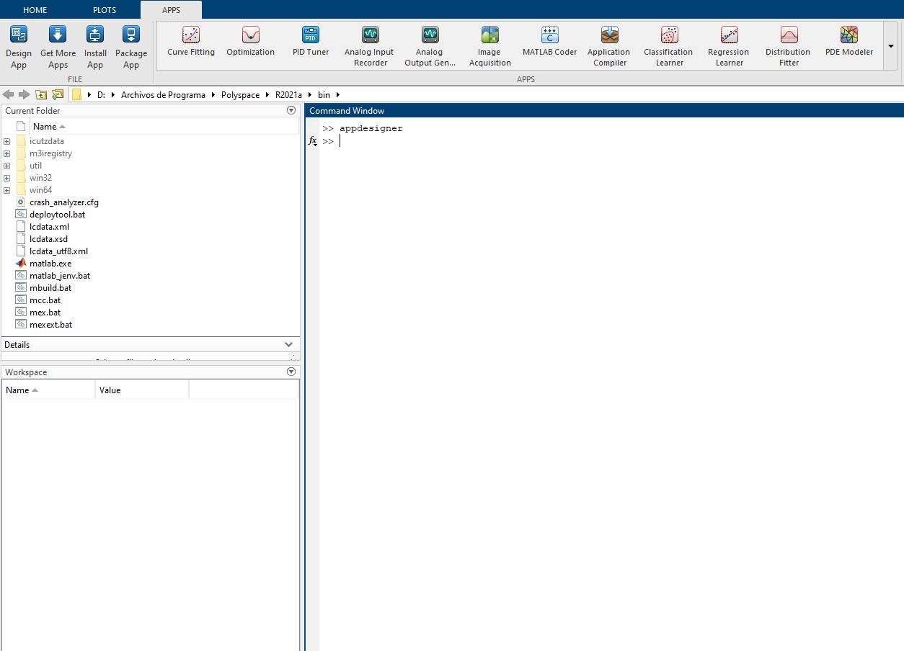
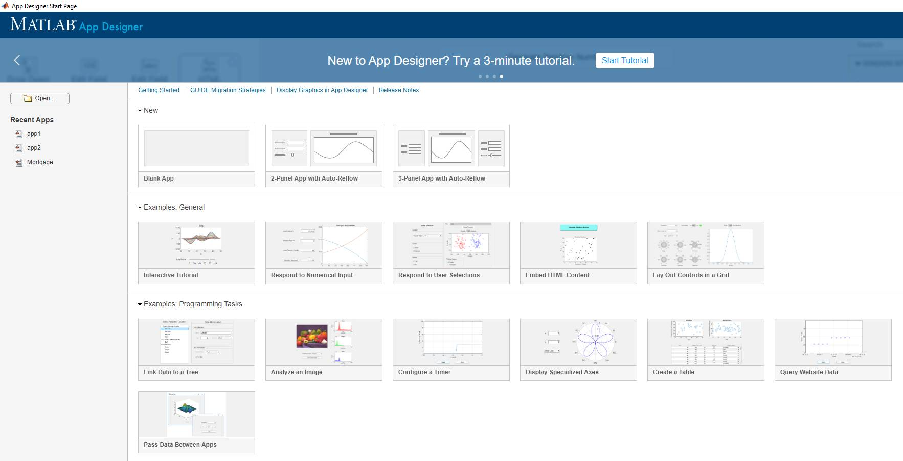
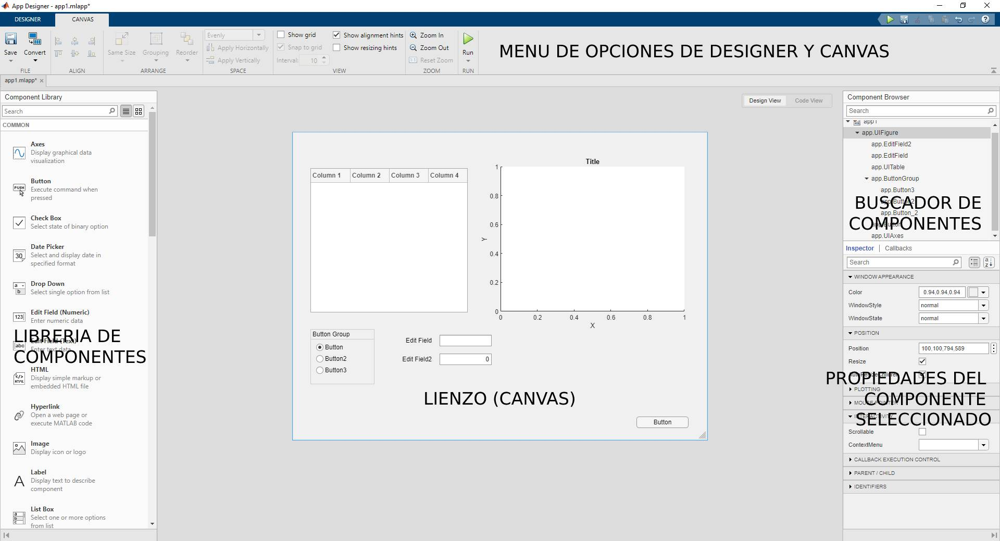
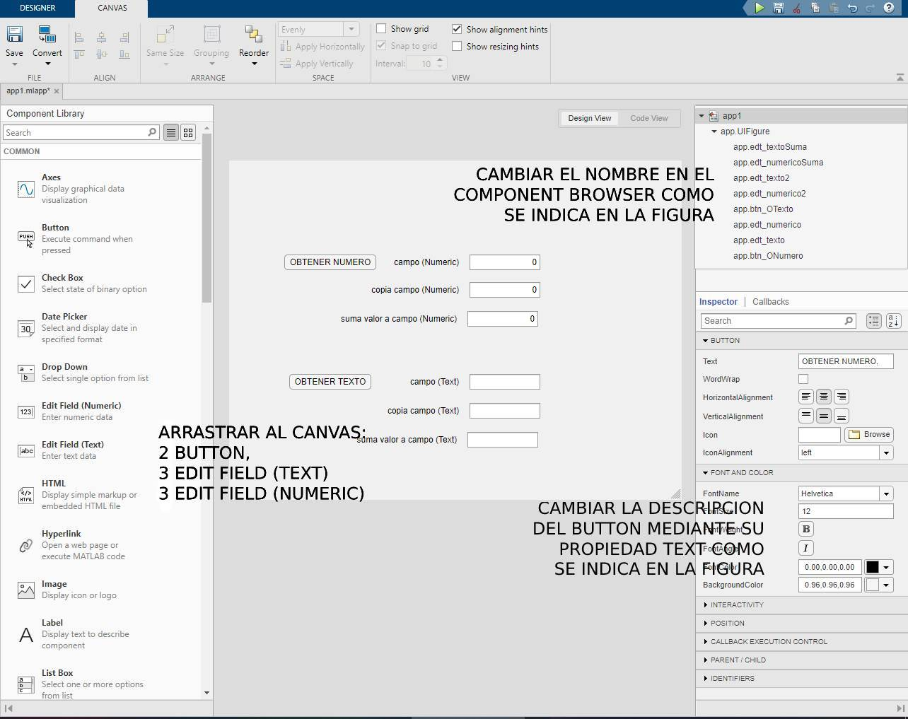
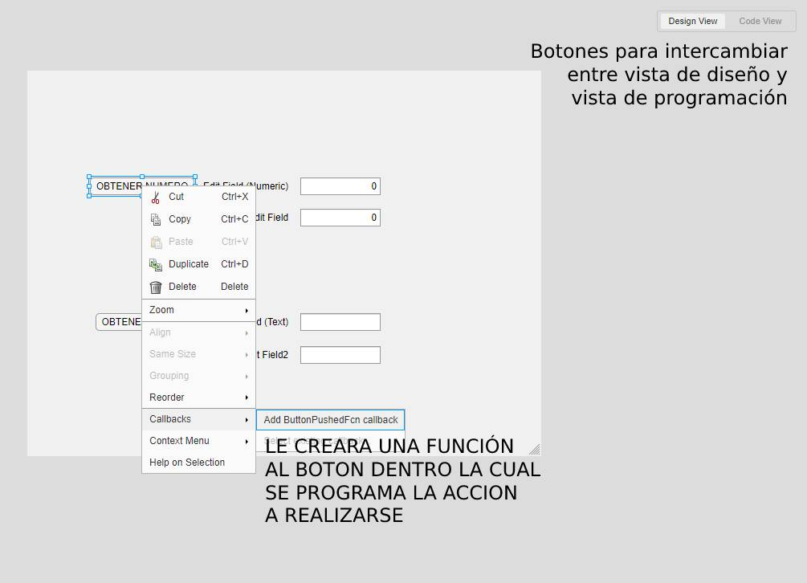
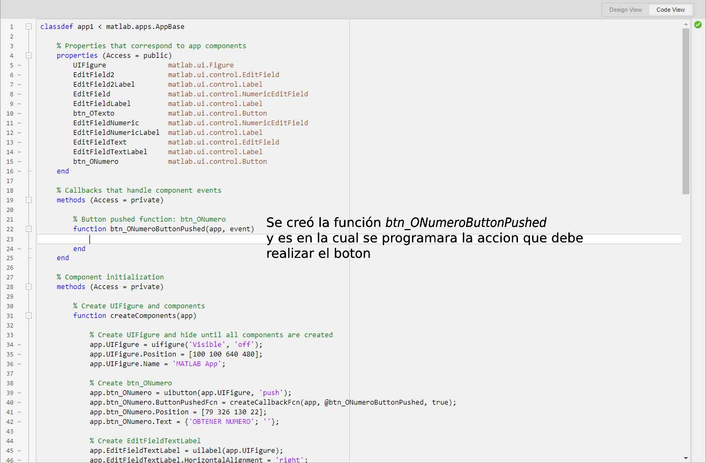
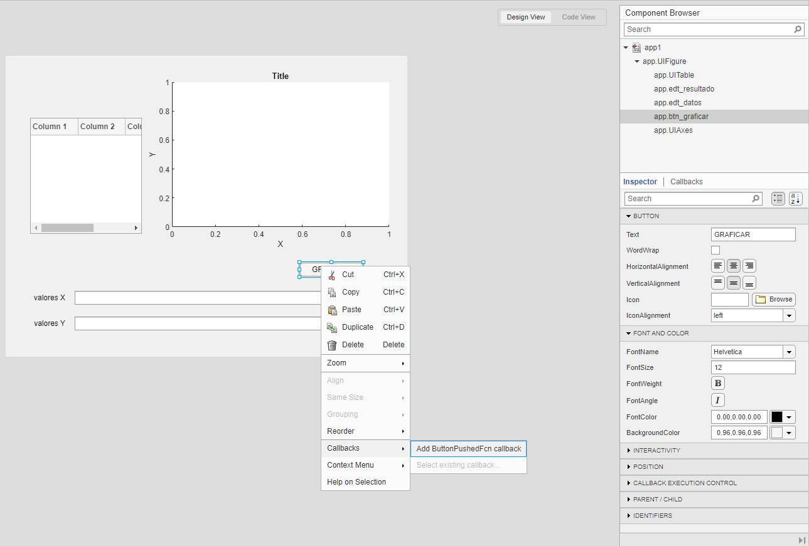
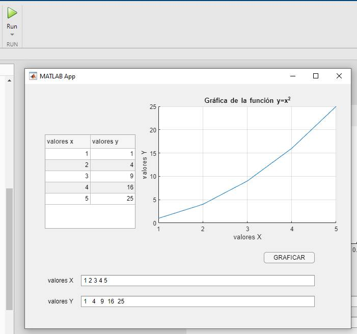

## ¿Que es App Designer?
App Designer es un entorno de desarrollo interactivo para diseñar una aplicación y programar su comportamiento. Totalmente integrado con el editor de MATLAB®. Permite distribuir apps empaquetándolas en los archivos del instalador directamente desde la barra de herramientas de App Designer.

### Entorno de App Designer
Podemos acceder al entorno de App Designer desde la penstaña APPS de MatLab o bien escribiendo appdesigner en la ventana de comando y luego presionando la tecla Intro.

<p style="text-align:center;"></p>

<p style="text-align:center; font-size: small">Figura 1: Dos posibles formas de acceder a App Designer desde MatLab</p>

A pesar de que podemos elegir entre una cantidad de plantillas, elegiremos trabajar con un documento en blanco.

<p style="text-align:center;"></p>

<p style="text-align:center; font-size: small">Figura 2: Pantalla de Inicio de App Designer</p>

Una vez hecho esto App Designer nos presentara el entorno de trabajo, el cual esta distribuido de la siguiente manera:

<p style="text-align:center;"></p>

<p style="text-align:center; font-size: small">Figura 3: Descripción del entorno de App Designer</p>

* **Menu de opciones de Designer y Cavas:** La penstaña Designer nos da las opciones de guardar y cargar nuestra aplicación realizada, ademas que nos da la opción de compilarla ya sea como MatLab App, Web App o Desktop App.

* **Librería de Componentes:**  Aquí encontramos todos los componentes necesarios para crear la interfaz gráfica de nuestra aplicación, como ser: objetos para gráficas, botones, cajas de texto, etc.

* **Canvas (Lienzo):**  Área de diseño de la interfaz de nuestra aplicación, simplemente arrastramos los componentes necesarios desde la libreria de componentes hacia el lienzo y los ubicamos en la ubicación requerida.

* **Propiedades de componentes:** Nos da acceso a las propiedades de los componentes seleccionados ubicados dentro del lienzo, como ser: nombre del componente, tamaño de fuente, color de texto, posición, etc. 

* **Buscador de componentes:** Nos da acceso a una lista de todos los componentes presentes en el canvas, nos proporciona una forma de poder localizar cualquier componente rapidamente, tambien podemos renombrar cualquier componente desde esa ventana y asignarles un evento en especifico. 

### Diseñando la parte gráfica de nuestra aplicación

Para diseñar simplemente basta con arrastar los componentes deseados de la libreria de componentes hacia nuestro canvas, ubicarlos en la posición que deseemos, renombrarlos (facilita la programación), cambiar el tamaño del texto que muestran, el color y su alineación.

***Programando Button y Edit Field***

Creamos la siguiente interfaz de nuestra app:

<p style="text-align:center;"></p>

<p style="text-align:center; font-size: small">Figura 4: Creando la interfaz de la app y cambiando algunos nombres y propiedades</p>

Ahora se deben de cambiar 2 cosas: el nombre de cada objeto desde el component browser presionando F2 sobre el componente seleccionado o haciendo doble clic sobre el mismo, y el texto que mostraran en la vista de interfaz gráfica mediante su propiedad Text en el panel de propiedades de objetos (Inspector). 

A continuación se presenta la siguiente tabla que indica los cambios:

<center>
<style type="text/css">
.tg  {border-collapse:collapse;border-spacing:0;}
.tg td{border-color:black;border-style:solid;border-width:1px;font-family:Arial, sans-serif;font-size:14px;
  overflow:hidden;padding:10px 5px;word-break:normal;}
.tg th{border-color:black;border-style:solid;border-width:1px;font-family:Arial, sans-serif;font-size:14px;
  font-weight:normal;overflow:hidden;padding:10px 5px;word-break:normal;}
.tg .tg-0pky{border-color:inherit;text-align:left;vertical-align:top}
</style>
<table class="tg">
<thead>
  <tr>
    <th class="tg-0pky">Objeto</th>
    <th class="tg-0pky">Nombre</th>
    <th class="tg-0pky">Propiedad Text</th>
  </tr>
</thead>
<tbody>
  <tr>
    <td class="tg-0pky">app.Button</td>
    <td class="tg-0pky">btn_ONumero</td>
    <td class="tg-0pky">OBTENER NUMERO</td>
  </tr>
  <tr>
    <td class="tg-0pky">app.Button2</td>
    <td class="tg-0pky">btn_OTexto</td>
    <td class="tg-0pky">OBTENER TEXTO</td>
  </tr>
  <tr>
    <td class="tg-0pky">app.EditField</td>
    <td class="tg-0pky">edt_numerico</td>
    <td class="tg-0pky">campo (Numeric)</td>
  </tr>
  <tr>
    <td class="tg-0pky">app.EditField2</td>
    <td class="tg-0pky">edt_numerico2</td>
    <td class="tg-0pky">copia campo (Numeric)</td>
  </tr>
  <tr>
    <td class="tg-0pky">app.EditField3</td>
    <td class="tg-0pky">edt_numericoSuma</td>
    <td class="tg-0pky">suma valor a campo (Numeric)</td>
  </tr>
  <tr>
    <td class="tg-0pky">app.EditField4</td>
    <td class="tg-0pky">edt_texto</td>
    <td class="tg-0pky">campo (Text)</td>
  </tr>
  <tr>
    <td class="tg-0pky">app.EditField5</td>
    <td class="tg-0pky">edt_texto2</td>
    <td class="tg-0pky">copia campo (Text)</td>
  </tr>
  <tr>
    <td class="tg-0pky">app.EditField6</td>
    <td class="tg-0pky">edt_textoSuma</td>
    <td class="tg-0pky">suma valor a campo (Text)</td>
  </tr>
</tbody>
</table>
</center>

La interfaz diseñada fue hecha bajo la idea de que cuando se introduzca un valor o una cadena de texto en las Edit Field y luego se presiona el *Button* "OBTENER NUMERO/TEXTO", este valor sea copiado a una segunda Edit Field.

Por lo anteriomente expuesto el codigo para cumplir esta tarea tiene que estar enlazadado al *Button* "OBTENER NUMERO", una de las varias formas para hacer esto es seleccionar El *Button* y dar clic derecho encima de el y elegir la opción *Add ButtonPushedFcn callback*.

<p style="text-align:center;"></p>

<p style="text-align:center; font-size: small">Figura 5: Una de varias formas de acceder al entorno de programación de App Designer</p>

Podemos ver como App Designer nos lleva la función creada en el botón para ahi escribir el código necesario para realizar las acciones anteriomente explicadas para el funcionamiento del botón.

<p style="text-align:center;"></p>

<p style="text-align:center; font-size: small">Figura 6: Entorno de programación de App Designer</p>

El codigo para leer un valor de una caja de texto, copiarlo a una segunda caja de texto y por ultimo sumarle otro numero y colocarlo en una tercera caja de texto es el siguiente:

``` matlab
%leera valor del campo numeric y lo guardara en la variable numero
numero=app.edt_numerico.Value
%imprimira la variable numero en copia campo numeric           
app.edt_numerico2.Value=numero
%sumara a la variable numero el valor de 5 e imprimira en sumar valor a campo          
app.edt_numericoSuma.Value=numero+5     
```
Si se coloca en el campo numerico una cadena de texto, te adivierte que este campo no acepta cadenas, solo valores numericos.

Para el *button* "OBTENER VALOR" procedemos de manera similar para crear el código (Fig 5).

```matlab
%leera valor del campo text y lo guardara en la variable texto
texto=app.edt_texto.Value
%imprimira la variable texto en copia campo text           
app.edt_texto2.Value=texto          
```

El objeto Edit Field (Text) a diferencia del Edit Field (Numeric) acepta cadenas de texto asi como números también, pero si intentamos sumar un valor numérico al número introducido en el campo text, nos dara un error *"Error using matlab.ui.control.EditField/set.Value (line 99) 'Value' must be a character vector or a string scalar."*

Esto sucede por que al utilizar Edit Field (Text), todo valor que se introduce en el, se reconoce como una cadena de texto, aunque sean números. Se puede convertir una cadena de texto en forma de número a valor numérico con las funciones *(str2double, str2num)* y para volver a imprimirlo se debe convertir el valor numérico a cadena de texto con la función *num2str*.

Asi que adecuamos el código a la siguiente manera:

```matlab
%leera valor (solo si se introduce numeros) del campo text, lo convierte de cadena 
%valor numérico, lo copia y le suma el valor de 5 y para volverlo imprimir usa la 
%función num2str.
texto=str2num(app.edt_texto.Value)          
app.edt_texto2.Value=num2str(texto)          
app.edt_textoSuma.Value=num2str(texto+5)
```

***Programando Axes y Table***

Crearemos una nueva Blank App desde la pestaña designer y le crearemos la siguiente interfaz gráfica:

<p style="text-align:center;"></p>

<p style="text-align:center; font-size: small">Figura 7: Interfaz gráfica de nuestra nueva aplicación</p>

Primero procederemos a crear un código que grafique una parabola, para lo cual deberemos colocar un matriz de valores X la Edit Field *valores X*, el código calculara los valores de Y con la ecuación $y=x^2$ y el vector de valores Y calculado se almacenara en el Edit Field *valores Y*.

Al mismo tiempo se graficará la curva en el AXES y se le colocará un título y etiquetas en el eje x, y ademas de habilitar la cuadrícula.

```matlab
%Obtenemos valores X del Edit Field edt_datos
valoresX=str2num(app.edt_datos.Value)
%Calculamos valores Y con los valores X obtenidos
valoresY=valoresX.^2
%Imprimimos los valores Y en la Edit Field edt_resultado
app.edt_resultado.Value=num2str(valoresY)
%Procedemos a graficar los valoresX, valoresY
plot(app.UIAxes,valoresX,valoresY)
%Poniendo titulo, etiqueta a los ejes, cuadricula
title(app.UIAxes,'Gráfica de la función y=x^2')
xlabel(app.UIAxes,'valores X')
ylabel(app.UIAxes,'valores Y')
grid(app.UIAxes,'On')
```

Por ultimo faltaria imprimir los valores X, Y en una tabla en vez de una Edit Field, para ello complementamos con el siguiente código:

```matlab
%Creamos una matriz *datos* la cual concatena las transpuestas de los vectores valoresX, valoresY
datos=[valoresX' valoresY']
%Colocamos el nombre de cada columna en la que se imprimira la matriz *datos*
app.UITable.ColumnName={'valores x' , 'valores y'}
%Finalmente imprimimos la matriz *datos* en la *Table*
app.UITable.Data=datos
```
Procedemos a presionar el boton Run del programa, e insertamos los números que deseemos separados por un espacio en el Edit Field valores X, presionamos calcular y observamos los resultados.

<p style="text-align:center;"></p>

<p style="text-align:center; font-size: small">Figura 8: Probando la aplicación terminada</p>

En esta pequeña guia de introducción a la App Designer de Matlab, se ha tratado de dar a conocer el diseño y la codificación de los objetos mas comunmente usados en una aplicación como ser: Edit Field, Button, Axes, Table y sus propiedades mas importantes y como sugerencia, preferir Edit Field (Text) en vez de Edit Field (Numeric) para su codificación.

## Referencia
* [MatLab Referencia](https://la.mathworks.com/help/matlab/app-designer.html)