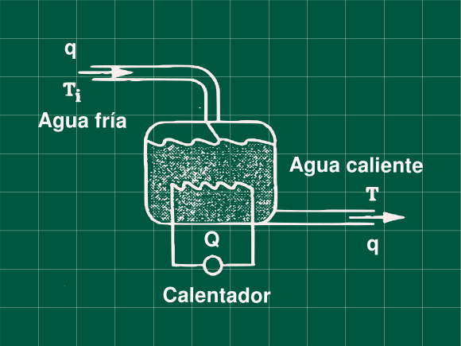

## Problema 5.1 (Process Dynamics, Modelling and Control - Babatunde, Harmon)

Para el proceso mostrado en la figura, un calentador electrico de agua. En un día particular el tanque trabajaba a temperatura de 80 °C, y de repente el calentador se rompe y dejar de suministrar calor, a este tiempo el tanque con 100 L de capacidad operaba con un caudal 10 L/min, la temperatura del agua fria es de 30 °C. Esto pasa durante 5 minutos, luego el calentador detiene el flujo de agua(debido al diseño del calentador).
Desarrolle un apropiado modelo matemático para este proceso, y resolviendo la ecuación diferencial encuentre la temperatura del tanque a los 5 minutos

## Resolución

Escribiendo nuestro balance de energía

$$
\rho C_p V \frac{dT}{dt}=q \rho C_p(T_i-T)+Q\space\space\space\textbf{ .... (1)}
$$

Balance en estado estacionario

$$
0 = q \rho C_p(T_{is}-T_s)+Q_s\space\space\space\textbf{ .... (2)}
$$

Calculamos la ecuación (2) el valor de $Q_s$ que nos a servir luego

$$
0 = q \rho C_p(30-80)+Q_s
$$

$$
Q_s=50q\rho C_p
$$

Restando (1) con (2) y tranformando a variables desviación

$$
\rho C_p V \frac{d(T-T_s)}{dt}=q \rho C_p\big[(T_i-T_{is})-(T-T_s)\big]+Q-Q_s
$$

$$
\rho C_p V \frac{dT'}{dt}=q \rho C_p\big[T'_i-T'\big]+Q'
$$

Aplicando la transformada de Laplace y despejando la función transferencia

$$
\rho C_p V sT'(s)=q \rho C_p\big[T'_i(s)-T'(s)\big]+Q'(s)
$$

$$
\frac{T'(s)}{Q'(s)}=\frac{1}{V\rho C_p s+q\rho C_p}\space\space\space\textbf{ .... (3)}
$$

Describimos la perturbación del enunciado sabemos que el calor suministrado baja cero cuando t>0.

$$
Q'(t)= Q(t)-Q_s
\begin{cases}
   Q_s-Q_s &\text{si } t < 0 \\
   0 - Q_s &\text{si } t > 0\\
\end{cases}
$$

$$
Q'(t)=
\begin{cases}
   &\text{si } t < 0 \\
   - Q_s &\text{si } t > 0\\
\end{cases}
$$

$$
Q'(t) = -Q_s
$$

Aplicando al transformada de Laplace

$$
Q'(s)= -\frac{Q_s}{s}
$$

Reemplazando en la ecuacion (3) y sabiendo que $Q_s=50q\rho C_p$

$$
T'(s)=-\frac{50q\rho C_p}{s(V\rho C_p s+q\rho C_p)}
$$

Operando y reemplazando valores conocidos $V=100$ y $q=10$

$$
T'(s)=-\frac{50}{s(Vs+q)}=-\frac{50}{s(10s+1)}
$$

Antitransformando, recuerde $T'(t) = T(t)-T_s$

$$
T'(t)=50(e^{-t/10}-1)
$$

$$
T(t)=50(e^{-t/10}-1)+80
$$

Hallando la temperatura a t = 5 min
$$
T(t=5)=50(e^{-5/10}-1)+80
$$

$$
\mathbf{T(t=5min)=60.33\ °C}
$$

## Referencias

* Babatunde, A. O.; Harmon, W. R. (1994). _process dynamics, modeling, and control_. OXFOR UNIVERSITY PRESS. ISBN 0-19-509119-1

