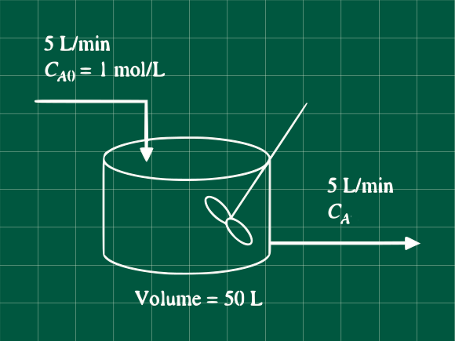

## Problema 5.16 (Process Systems Analysis and Control - Coughanowr, LeBlanc)

Para el reactor de mezcla completa mostrada en la figura, determine la función de transferencia que relaciona la concentración de salida con la concentración de la alimentación. Si cambiamos la concentración de entrada de 1 a 2 mol/L, ¿Cuál es la nueva concentración de salida? y ¿Cuál es la concentración en el nuevo estado estacionario?

Nuestros datos

$$
k = \frac{2\cdot L}{mol\cdot min}
$$

Reacción

$$
2A\Rightarrow B\\
$$

$$
-r_A=kC_A^2
$$

### Resolviendo

Linealicemos el término cuadrático antes. Usando la serie de Taylor truncada a primer orden

$$
f(x)=f(x_s)+\frac{df}{dx}\bigg |_{x=x_s} (x-x_s)
$$

Siendo nuestra función a linealizar $f(C_{A})=C_A^2$

$$
C_A^2=C_{As}^2+2\cdot C_{As}(C_A-C_{Aas})
$$

$$
C_A^2-C_{As}^2=2\cdot C_{As}(C_A-C_{Aas})\space\space\space\space\space\textbf{... (1)}
$$

Escribiendo nuestro balance de materia, sabiendo que $n_o = C_0V$

$$
C_{A0}F-C_AF-kC_A^2V=\frac{dn_o}{dt} = \frac{d(C_AV)}{dt}
$$

$$
C_{A0}F-C_AF-kC_A^2V=V \frac{d(C_A)}{dt} \space\space\space\space\space\textbf{... (2)}
$$

Realizando el balance en estado estacionario

$$
C_{A0s}F-C_{As}F-kC_{As}^2V=0 \space\space\space\space\space\textbf{... (3)}
$$

Restado (3) de (2). Recuerde que $d(C_A)=d(C_A-C_{As})$

$$
(C_{A0}-C_{A0s})F-(C_A-C_{As})F-(C_A^2-C_{As}^2)kV=V \frac{d(C_A-C_{As})}{dt}
$$

Transformando a variables desviación y reemplazando la ecuación (1)

$$
C'_{A0}F-C'_AF-\big[2C_{As}(C_A-C_{As})\big]kV=V \frac{d(C'_A)}{dt}
$$

$$
C'_{A0}F-C'_AF-2C_{As}(C'_A)kV=V \frac{d(C'_A)}{dt}
$$

Aplicando la transformada de Laplace y despejando y sabiendo que $C'_A(t=0) = 0$

$$
C'_{A0}(s)F-C'_A(s)F-2C_{As}C'_A(s)kV=V (sC'_A(s)-C'_A(t=0))
$$

$$
FC'_{A0}(s)-FC'_A(s)-2C_{As}kVC'_A(s)=V sC'_A(s)\space\space\space\space\space\textbf{... (4)}
$$

Para simplificar el manejo de la ecuación (4) necesitamos reemplazar datos, pero nos falta conocer un dato $C_{As}$, para hallar utilizamos la ecuación (3), conociendo que: $k = 2;\space\space$ $C_{A0s} = 1;\space\space$ $V=50\space\space$ y $\space F= 5$

$$
5\times 1-5\times C_{As}-2\times 50\times C_{As}^2=0
$$

$$
1-C_{As}-20\times C_{As}^2=0
$$
Usando la formula cuadrática para resolver $C_{As}$ y sólo tomando en cuenta el valor positivo

$$
C_{As}=\frac{-1±\sqrt{1+4\times 20}}{2\times 20}
$$
$$
C_{As}=\frac{-1+9}{40}
$$
$$
C_{As}=0.2
$$
Reemplazando en la ecuación (4)
$$
5C'_{A0}(s)-5C'_A(s)-2\times 0.2\times 2\times 50\times C'_A(s)=50\times sC'_A(s)
$$

$$
C'_{A0}(s)-9C'_A(s)=10 sC'_A(s)
$$

$$
\mathbf{\frac{C'_{A}(s)}{C'_{A0}(s)}=\frac{1}{10s+9}}\space\space\space\space\space\textbf{... (5)}
$$

Para resolver la respuesta a la pertubación indicada debemos describir la pertubación

$$
C'_{A0}(t)=C_{A0}-C_{A0s}=
\begin{cases}
   1 - 1 &\text{si } t < 0 \\
   2 - 1 \space\ mol/L &\text{si } t>0\\
\end{cases}
$$

$$
C'_{A0}(t)=
\begin{cases}
   0 &\text{si } t < 0 \\
   1 \space\ mol/L &\text{si } t>0\\
\end{cases}
$$

$$
C'_{A0}(t)= 1\space u(t)
$$

Entonces su transforma da de Laplace es

$$
C'_{A0}(s)= \frac{1}{s}
$$

Reemplazando en la ecuación (5)

$$
C'_{A}(s)=C'_{A0}\frac{1}{10s+9}
$$

$$
C'_{A}(s)=\frac{1}{s(10s+9)}
$$

Reordenando para obtener la antitransformada (Recuerde que tambien puede obtener la antitransformada directamente de tablas)

$$
C'_{A}(s)=\frac{9}{9s(10s+9)}=\frac{9+10s-10s}{9s(10s+9)}
$$

$$
C'_{A}(s)=\frac{9+10s}{9s(10s+9)}-\frac{10s}{9s(10s+9)}
$$

$$
C'_{A}(s)=\frac{1}{9s}-\frac{10}{9(10s+9)}
$$

$$
C'_{A}(s)=\frac{1}{9s}-\frac{1}{9(s+9/10)}
$$

Antitransformando

$$
C'_A(t) = \frac{1}{9}-\frac{1}{9}e^{-9t/10}
$$

Hallando la concentración cuando t = 1 min

$$
C_A(t=1) = C'_A(t=1)+C_{As}

$$

$$
C_A(t=1)=\frac{1}{9}(1-e^{-9/10})+0.2
$$

$$
\mathbf{C_A(t=1\textbf{ min})=0.2659\textbf{ mol/L}}
$$
Para hallar la nueva concentración en el estado estacionario hacemos que el tiempo tienda a infinito ($t\to\infty$)

$$
C_A(t\to\infty)=\lim_{t\to\infty}\left(\frac{1}{9}(1-e^{-9t/10})+0.2\right)
$$

$$
\mathbf{C_A(t\to\infty)=\textbf{ 0.3111 mol/L}}
$$

## Referencias

* Coughanowr, D. R.; LeBlanc, S. E. (2009). _Process Systems Analysis and Control_ (3rd edition). McGraw-Hill. ISBN 978-0-07-339789-4.