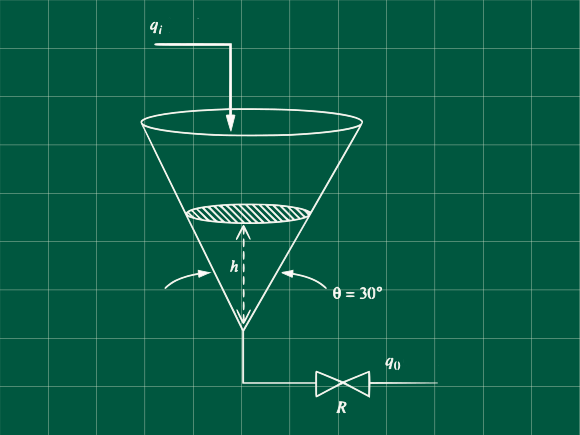

## Problema 5.18 (Process Systems Analysis and Control - Coughanowr, LeBlanc)

Encuentre la función transferencia que relaciona la altura del embudo tanque y los cambios en el caudal de entrada.

Asumiendo densidad constante, realizamos nuestro balance de materia

$$
q_i-q_o=\frac{dV}{dt}\space\space\space\space\textbf{... }\mathbf{(\alpha)}
$$

Observamos que nuestro volumen es dependiente de la altura de manera no lineal.
Nuestro radio y volumen estan en función de la altura

$$
r = h\cdot tan(15°)
$$

$$
V = \frac{\pi r^2 h}{3}
$$

Poniendo el volumen en función de h, y haciendo $k_1=\pi tan^2(15°)/3$
$$
V = \frac{\pi tan^2(15°)}{3}h^3
$$

$$
V = k_1h^3
$$

Linealizando usando la serie de Taylor truncada a primer orden, alrededor del estado estacionario

$$
f(x)=f(x_s)+\frac{df}{dx}\bigg |_{x=x_s} (x-x_s)
$$

Siendo nuestra función a linealizar $f(h)=V=k_1h^3$, recuerde que $f(h_s)=V_s=k_1h_s^3$

$$
V=k_1h_s^3+3k_1h_s^2(h-h_s)
$$

$$
V=V_s+3k_1h_s^2(h-h_s)
$$

$$
V-V_s=3k_1h_s^2(h-h_s)
$$

Diferenciando la ecuación convenientemente

$$
d(V-V_s)=3k_1h_s^2\cdot d(h-h_s)\space\space\space\space\textbf{... }\mathbf{(\beta)}
$$

Trabajando en la ecuación $\alpha$, Asumiendo linealidad de la válvula entonces reemplazando $q_o=h/R$

$$
q_i-\frac{h}{R}=\frac{dV}{dt}\space\space\space\space\textbf{... }\mathbf{(\gamma)}
$$

Reescribiendo la ecuación en estado estacionario

$$
q_{is}-\frac{h_s}{R}=0\space\space\space\space\textbf{... }\mathbf{(\theta)}
$$

Restando $\theta$ de $\gamma$ y sabiendo que $dV=d(V-V_s)$ por ser $V_s$ constante.

$$
q_i-q_{is}-\frac{h-h_s}{R}=\frac{d(V-V_s)}{dt}
$$

Reemplazando la ecuación $\beta$

$$
q_i-q_{is}-\frac{h-h_s}{R}=3k_1h_s^2\frac{d(h-h_s)}{dt}
$$

Cambiando a variables desviación

$$
Q_i-\frac{H}{R}=3k_1h_s^2\frac{d(H)}{dt}
$$

Aplicando la transformada de Laplace ($H(t=0) = h_s-h_s = 0$)

$$
Q_i(s)-\frac{H(s)}{R}=3k_1h_s^2(sH(s)-H(t=0))
$$

$$
Q_i(s)-\frac{H(s)}{R}=3k_1h_s^2sH(s)
$$

$$
\frac{H(s)}{Q_i(s)}=\frac{R}{3k_1h_s^2R\cdot s+1}
$$

Reemplazando adecuadamente y sabiendo que $k_1=\pi \cdot tan^2(15°)/3$

$$
\frac{H(s)}{Q_i(s)}=\frac{K_p}{\tau s+1}
$$

Con $\tau =\pi \cdot  tan^2(15°)\cdot h_s^2\cdot R\space\space;$ $\space\space K_p = R$

## Referencias

* Coughanowr, D. R.; LeBlanc, S. E. (2009). _Process Systems Analysis and Control_ (3rd edition). McGraw-Hill. ISBN 978-0-07-339789-4.