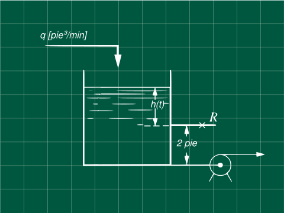

## Problema 5.2 (Process Control- Coughanowr, LeBlanc)

El sistema mostrado en la figura tienen un área seccional $A=3\text{ pie²}$, la ecuación de la válvula es $q=8\sqrt{h}$. Con q en [pie³/min] y h (altura desde encima de la válvula) en [pie].

Calcule la constante del tiempo $\tau$ para cuando la altura por encima de la válvula en estado estacionario es **a)** 3 pie y **b)** 9 pie.

### Resolviendo

$$
\begin{array}{l}
Datos\\
A = 3 \text{ pie²}\\
q_0=8 \sqrt{h}
\end{array}
$$

Linealizando $q_0=8 \sqrt h$

La expandimos usando las serie de Taylor al rededor del estado estacionario.

$$
f(x) = f(x_s)+\frac{df}{dt}\bigg |_{x=x_s} (x-x_s)
$$

$$
q_0=8\sqrt{h_s}+\frac{4}{sqrt{h_s}}(h-hs)
$$
$$
q_0=q_{0s}+\frac{4}{sqrt{h_s}}(h-hs)
$$

$$
q_0-q_{0s}=\frac{4}{\sqrt{h_s}}(h-hs)
$$

Hagamos $R=\frac{\sqrt{h_s}}{4}\space\space\space\textbf{ (A)}$

$$
q_0-q_{0s}=\frac{(h-hs)}{R}\space\space\space\space\textbf{(1)}
$$

Realizando el balance en el sistema

$$
q - q_0 - q_b= \frac{dV}{dt} \space\space\space\space (2)\textbf{(2)}
$$

Escribiendo el balance en estado estacionario

$$
q_s- q_s0 -q_b= 0 \space\space\space\space \textbf{(3)}
$$

Restando (2) con (1) para obtener las variables desviación y recordando que $dh=d(h-h_s)$, por ser $h_s$ constante.

$$
q-q_s-(q_s-q_s0)=A\frac{d(h-h_s)}{dt}
$$

Reemplazando con la ecuación (1)

$$
q-q_s-\frac{(h-hs)}{R}=A\frac{d(h-h_s)}{dt}
$$

Transformando a variables desviación

$$
Q - \frac{H}{R} = A\frac{dH}{dt}
$$

Aplicando la tranformada de Laplace y sabiendo que $H(t=0)= h-h_s=h_s-h_s=0$

$$
Q(s) - \frac{H(s)}{R} = A\left[sH(s)-H(t=0)\right]\\
\\
Q(s) - \frac{H(s)}{R} = AsH(s)
$$

$$
\frac{H(s)}{Q(s)}=\frac{R}{ARs+1} \\
$$

Por comparación con el modelo de primer orden $\frac{H(s)}{Q(s)}=\frac{Kp}{\tau s+1}$ y sabiendo que $A=3$ y $R = \sqrt{h_s}/4$

Notamos que
$$\tau=AR=3\frac{\sqrt{h_s}}{4}$$

Para a) $h_s=3$
$$
\mathbf{\tau = 1.2990\space min}
$$
Para b) $h_s=9$
$$
\mathbf{\tau = 2.25 \space min}
$$

## Referencias

* Coughanowr, D. R.; LeBlanc, S. E. (2009). _Process Systems Analysis and Control_ (3rd edition). McGraw-Hill. ISBN 978-0-07-339789-4.