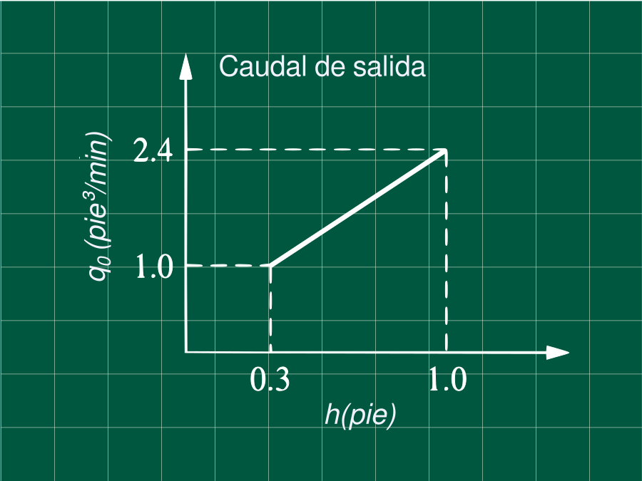

## Problema 5.3 (Process Systems Analysis and Control - Coughanowr, LeBlanc)

Un tanque con un área seccional de 2 pie² opera en estado estacionario con un flujo de entrada de 2 pie³/min. El flujo de salida vs la altura del sistema son representados en la figura.

Encuentre:

* La función transferencia $H(s)/Q(s)$.

* Si el flujo hacia el tanque se incrementa en de 2.0 a 2.2 pie³/min (paso unitario), calcule el nivel h, 2 minutos después del cambio.

$$
\begin{array}{l}
Datos\\
A = 2\space pie²\\
q_s = 2\space pie³/min
\end{array}
$$

### Obtención de la ecuación $q_0$

Como se observa en la gráfica $q_0$ es función de la altura y es una recta. Usando la fórmula de la ecuación de la recta que pasa por dos puntos tenemos $(h_{1}=0.3,q_{01}=1)$ y $(h_{2}=1,q_{02}=2.4)$  :

$$
\frac{q_0-q_{01}}{h-h_1}=\frac{q_{02}-q_{01}}{h_2 - h_1}\\
$$
$$
\frac{q_0-1}{h-0.3}=\frac{2.4-1}{1 - 0.3}\\
$$
$$
q_0 = 2h+0.4
$$

Escribiendo las ecuaciones de balance
$$
q - q_0 = \frac{dV}{dt}
$$

Pero $q_0 = 2h+0.4$ y  $dV = Adh$

$$
q- (2h+0.4) = A\frac{dh}{dt} \space\space\space\space (1)
$$

Escribiendo el balance en estado estacionario

$$
q_s- (2h_s+0.4) = 0 \space\space\space\space (2)
$$

Restando (1) con (2) para obtener las variables desviación y recordando que $dh=d(h-h_s)$, por ser $h_s$ constante.

$$
q-q_s-2(h-h_s)+=A\frac{d(h-h_s)}{dt}
$$

$$
Q - 2\cdot H = A\frac{dH}{dt}
$$

Aplicando la tranformada de Laplacey sabiendo que $H(t=0)= h-h_s=h_s-h_s=0$

$$
Q(s) - 2H(s) = A(sH(s)-H(t=0))\\
$$
$$
Q(s) - 2H(s) = AsH(s)
$$

Despejando

$$
\mathbf{\frac{H(s)}{Q(s)}=\frac{1}{2 s+2}} \space\space\space\space (3) \\
$$

### Descripción de la perturbación

La perturbación sólo va a afectar el caudal de ingreso, esta puede ser representado por la variable desviación $Q(t)$

$$
Q(t)=q-q_s=
\begin{cases}
   2.0-2.0 &\text{si } t < 0 \\
   2.2-2.0 \space\ pie³/min &\text{si } t>0\\
\end{cases}
$$

$$
Q(t)=
\begin{cases}
   0 &\text{si } t < 0 \\
   0.2 \space\ pie³/min &\text{si } t>0\\
\end{cases}
$$

Expresando la misma función con impulsos unitarios y aplicando la transformada de Laplace

$$
Q(t) = 0.2\cdot u(t)
$$
Entonces

$$
Q(s) = \frac{0.2}{s}
$$

### Resolviendo para $h(t=2)$

Reemplazando la expresión anterior en la ecuación (3)

$$
\begin{array}{l}
H(s)= Q(s)\cdot \frac{1}{2s+2} \\
\\
H(s) = \frac{0.2}{s(2s+2)}\\
\end{array}
$$

Operando para realizar la antitransformada

$$
H(s) = \frac{0.2+0.2s-0.2s}{s(2s+2)}=\frac{0.1(2s+2)}{s(2s+2)}-\frac{0.2s}{s(2s+2)}
$$

$$
H(s) = \frac{0.1}{s}-\frac{0.1}{(s+1)}\\
$$

Aplicando la antitransformada $L^{-1}\{\space\}$

Recuerde $L^{-1}\{\frac{1}{s+k}\}= e^{-kt}$

$$
H(t) = 0.1-0.1\cdot e^{-t}
$$

Calculando h(t=2)

De la ecuación en estado estacionario

$$
q_s-(2h_s+0.4)=0 => h_s=0.8
$$

Entonces

$$
h(t=2) = H(t=2) + h_s
$$

$$
h(t=2)=0.1\cdot (1-e^{-2})+0.8
$$

$$
\mathbf{h(t=2)=0.8865\text{ pie}}
$$

## Referencias

* Coughanowr, D. R.; LeBlanc, S. E. (2009). _Process Systems Analysis and Control_ (3rd edition). McGraw-Hill. ISBN 978-0-07-339789-4.
