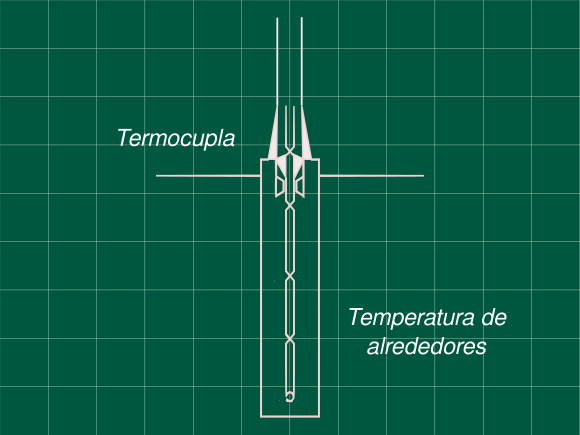
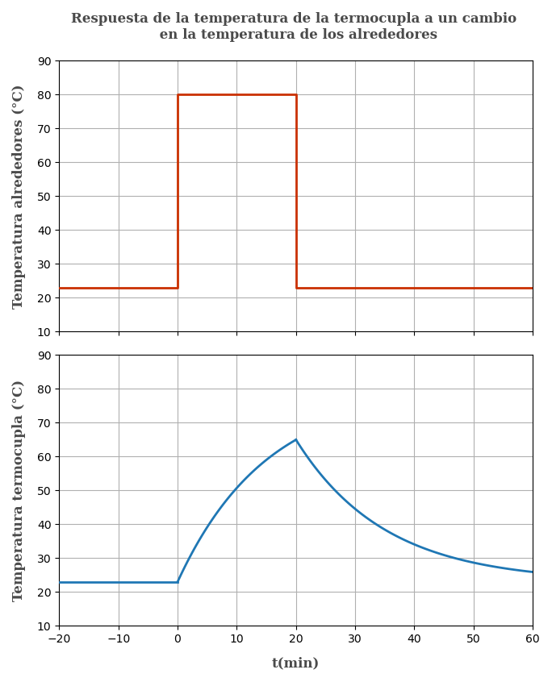

## Problema 5.5 (Process Dynamics and Control - Seborg, Edgar, M, D)

Una termocupla tiene las siguientes características cuando es sumergido en un tanque agitado:

$$
\begin{array}{rl}
Masa\ termocupla\ & =\ 1\ g\\
Capacidad\ calorífica\ & =\ 0.25\ cal/(cm^2\ °C)\\
Coeficiente\ de\ transferencia\ de\ calor\  & =\ 20\ cal/(cm^2\ h\ °C)\\
Área\ de\ superficie\ de\ la\ termocupla\ & =\ 3\ cm^2\\

\end{array}
$$

Halle la función transferencia de la termocupla que relaciona la temperatura de la termocupla $T$ y la de la de los alrededores $T_A$.

Si la termocupla esta inicialmente fuera tanque, con una temperatura ambiente de 23 °C. ¿Cuál será la máxima temperatura alcanzada si es puesta en el tanque a temperatura de 80 °C, y se la saca después de 20s?

Grafique las la variación de temperatura de la termocupla.

### Hallando la función transferencia

Escribiendo el balance de energía en estado transitorio y en estado estacionario.

$$
mC_p\frac{dT}{dt}=UA(T_A-T)
$$

$$
0=UA(T_{As}-T_s)
$$

Restando ambas ecuaciones y pasando a variables desviación

$$
m C_p \frac{d(T-T_s)}{dt}=UA\big[(T_A-T_{As})-(T-T_s)\big]
$$

$$
mC_p\frac{dT'}{dt}=UA(T'_A-T')
$$

Aplicando la transformada de Laplace, sabiendo que para el estado estacionario T'(t=0)=0

$$
mC_ps\space T(s)=UA(T'_A(s)-T'(s))
$$

Despejando la función tranferencia y haciendo $\tau = (mC_p)/(UA)$ en segundos

$$
\frac{T'(s)}{T'_A(s)}=\frac{1}{\tau s+1}
$$

$$
\tau = \frac{1\ g\ \times 0.25\ \frac{cal}{g\ °C}}{20\frac{cal}{cm^2\ h\ °C}\times \frac{1\ h}{360\ s}3\ cm^2}
$$
$$
\tau = 15
$$

$$
\mathbf{\frac{T'(s)}{T'_A(s)}=\frac{1}{15 s+1}}\space\space\space\space\textbf{... (1)}
$$

### Describiendo la perturbación

$$
T'_A(t)= T_A(t)-T_{As}
\begin{cases}
   0 &\text{si } t < 0 \\
   80-23\ °C &\text{si } 0< t < 20\\
   0 &\text{si } t>20\\
\end{cases}
$$

$$
T'_A(t)=57u(t)-57u(t-20)
$$

Aplicando la antitransformada

$$
T'_A(s)= \frac{57}{s}-57\frac{e^{-20s}}{s}
$$

Reemplanzando en la ecuación (1)

$$
T'(s)=\frac{57}{s(15 s+1)}-\frac{57e^{-20s}}{s(15 s+1)}
$$

Realizando la antitransformada (de tablas). Recuerde que $e^{-as}$ crea un desfase en la antitransformada igual a $t= t-a$

$$
T´(t)=57(1-e^{-t/15})u(t)-57(1-e^{-t/15})u(t)|_{t=t-20}
$$

$$
T´(t)=57(1-e^{-t/15})u(t)-57(1-e^{-(t-20)/15})u(t-20)
$$

$$
T(t)=T'(t)+T_s
$$
$$
T(t)=57(1-e^{-t/15})u(t)-57(1-e^{-(t-20)/15})u(t-20)+23
$$
Expresando esta función de manera más entendible

$$
T(t)= 
\begin{cases}
   57(1-e^{-t/15})+23 &\text{si  } 0<t< 20 \\
   57(-e^{-t/15}+e^{-(t-20)/15})+23 &\text{si  } t > 20\\
\end{cases}
$$

Las funciones son monotonicas en ambos rangos, por lo que para el máximo bastará con analizar el punto anguloso, la temperatura máxima se da un instante antes de sacar la termocupla del tanque a 80 °C, es decir a los 20 s.

$$
T(t=20)=57(1-e^{-20/15})+23
$$

$$
\mathbf{T_{max}=64.974\ °C}
$$

### Gráfica de la función

## Referencias

* Seborg, D. E.; Edgar, T. F.; Mellichamp, D. A.; Doyle, F. J. (2016). _Process Dynamics and Control_ (4th edition). John Wiley & Sons, Inc. ISBN 978-1-119-28591-5.
