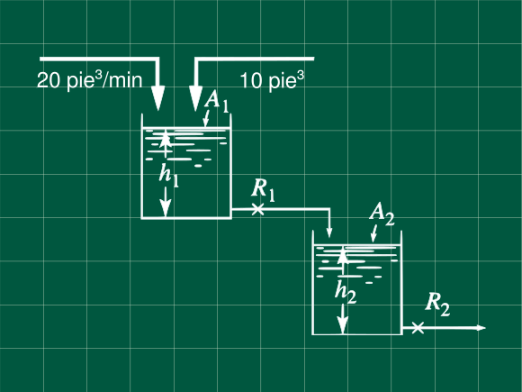
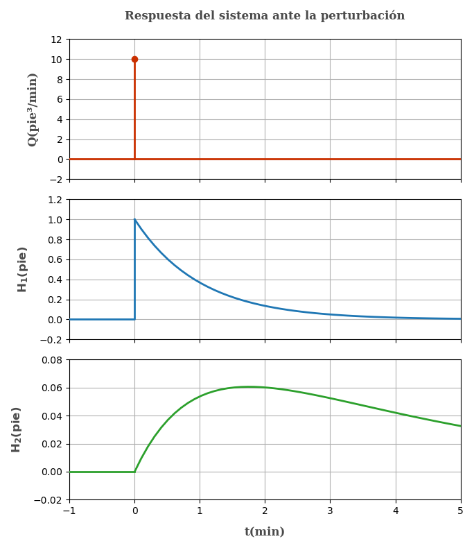

## Problema 7.2 (Process Systems Analysis and Control - Coughanowr, LeBlanc)

Dos tanques mostrados en la figura, operan en estado estacionario. At t=0 se agregan al primer tanque, 10 pie³ de agua de manera repentina. Usando apropiadamente las figuras y ecuaciones, determine la máxima desviación del nivel del líquido en ambos tanques del estado estacionario y el tiempo en el cuál ocurre.

$$
\begin{array}{l}
A_1=A_2=10\space pie²\\
R_1=0.1\space pie/(pie³/min)\\
R_2=0.35\space pie/(pie³/min)\\
\end{array}
$$

Escribiendo las ecuaciones de balance 

### Obtención de la ecuación en transferencia

Pero $q_1 = h_1/R_1$ y  $dV_1 = A_1dh_1$

$$
q- \frac{h_1}{R} = A\frac{dh_1}{dt} \space\space\space\space (1)
$$

Escribiendo el balance en estado estacionario

$$
q_s- \frac{h_{1s}}{R_1} = 0 \space\space\space\space (2)
$$

Restando (1) con (2) para obtener las variables desviación y recordando que $dh=d(h-h_s)$, por ser $h_s$ constante.

$$
q-q_s-\frac{h_1-h_{1s}}{R_1}=A\frac{d(h_1-h_{1s})}{dt}
$$

$$
Q - \frac{H_1}{R_1} = A\frac{dH_1}{dt}
$$

Aplicando la tranformada de Laplacey sabiendo que $H_1(t=0)= h_1-h_{1s}=h_{1s}-h_{1s}=0$

$$
Q(s) - \frac{H_1(s)}{R_1} = A_1\left[sH_1(s)-H_1(t=0)\right]\\
$$

$$
Q(s) - \frac{H_1(s)}{R_1} = A_1sH_1(s)
$$

Reordenando obtenemos la ecuación de tranferencia del primer tanque

$$
\frac{H_1(s)}{Q(s)} = \frac{R_1}{A_1R_1s+1}\space\space\space\space\textbf{... (3)}
$$

Reemplazando datos $R_1=0.1\text{   ;}A_1=10$  obtenemos la ecuación de tranferencia del primer tanque.

$$
\mathbf{\frac{H_1(s)}{Q(s)} = \frac{0.1}{1s+1}} \space\space\space\space\textbf{... }\mathbf{(\alpha)}
$$

De similar manera podemos obtener la ecuación de transferencia para el segundo tanque

$$
\frac{H_2(s)}{Q_1(s)} = \frac{R_2}{A_2R_2s+1}\space\space\space\space\textbf{... (4)}
$$

Recuerde que tambien se cumple
$$
Q_1(s)=\frac{H_1(s)}{R_1}
$$

Reemplazando en (4)

$$
\frac{H_2(s)\cdot R_1}{H_1(s)} = \frac{R_2}{A_2R_2s+1}\space\space\space\space\textbf{... (5)}
$$

Multipicando las ecuaciónes (3) con (5)  y simplificando obtenemos la ecuación de transferencia del segundo tanque.

$$
\frac{H_2(s)}{Q(s)} = \frac{R_2}{(A_2R_2s+1)(A_1R_1s+1)}\space\space\space\space\textbf{... (6)}
$$

Reemplazando con los datos $R_1=0.1\text{   ;}A_1=A_2=10\text{   ;}R_2=0.35$

$$
\mathbf{\frac{H_2(s)}{Q(s)} = \frac{0.35}{(3.5s+1)(s+1)}} \space\space\space\space\textbf{... }\mathbf{(\beta)}
$$

Ahora describamos la perturbación

$$
Q(t)=
\begin{cases}
   0 \space &\text{si } t<0\\
   10 \space\ pie³/min \space\space\space (\infty)&\text{si } t=0 \space min\\
   0 \space\ &\text{si } t>0 \\
\end{cases}
$$

Entonces
$$
Q(t) = 10 \delta (t)
$$

Aplicando la transformada

$$
Q(s) = 10
$$

Para el primer tanque reemplazanado en la ecuación $(\alpha)$

$$
H_1(s) = \frac{0.1Q(s)}{s+1}  = \frac{0.1\times 10}{s+1} =\frac{1}{s+1} 
$$

Antitransformando

$$
H_1(t) = e^{-t}
$$
Notamos que la función es decreciente el máximo valor que toma es al inicio. Por lo que el máximo valor de la desviación es cuando t=0. Puede confirmar esto reemplazando cualquier valor de t>0, ó graficando la función.

$$
H_1(t=0) = e^{-0} = 1
$$

Entonces el la desviación máxima es **1 pie** en el nivel del líquido del primer tanque a **t = 0 min**.

Para el segundo tanque reemplazando $Q(s)=10$ en la ecuación $\beta$

$$
H_2(s) = \frac{0.35\times Q(s)}{(3.5s+1)(s+1)} = \frac{3.5}{(3.5s+1)(s+1)}
$$

Expandiendo el termino del lado derecho en fracciones parciales (Puede obtener el mismo resultado si usa las tablas)

$$
\frac{3.5}{(3.5s+1)(s+1)} = \frac{A}{(3.5s+1)}+\frac{B}{(s+1)}
$$

$$
3.5 = A(s+1)+B(3.5s+1)
$$

Recuerde que es una ecuación y cumple para cualquier valor de $s$. Eligiendo el valor conveniente de $s$ podemos hallar las constantes.

Cuando $s=-1$ entonces $B = -0.35/2.5$

para $s=-1/3.5$ el valor $A=0.35\times 3.5/2.5$

En nuestra ecuación original y reorganizando para la antitransformada

$$
H_2(s)=\frac{0.35}{2.5}\left(\frac{1}{s+1/3.5}-\frac{1}{s+1}\right)
$$

Aplicando la transformada inversa

$$
H_2(t)=\frac{0.35}{2.5}\left(e^{-t/3.5}-e^{-t}\right)
$$

Derivando e igualando a cero para hallar el máximo.

$$
\frac{dH_2(t)}{dt}=\frac{0.35}{2.5}\left(-\frac{e^{-t/3.5}}{3.5}-(-1)e^{-t}\right)=0
$$

Operando

$$
3.5e^{-t}=e^{-t/3.5}
$$

Despejando t 

$$
t=\frac{3.5\times ln(3.5)}{2.5} = 1.7539\text{ min}
$$

Reemplazandoen H_2(t)
$$
H_2(t=1.7539)=\frac{0.35}{2.5}\left(e^{-1.7539/3.5}-e^{-1.7539}\right) = 0.0606\text{ pie}
$$

Entonces la máxima desviación para el segundo tanque se da cuando **t = 1.7539 min** con una desviación del nivel del líquido de **0.0606 pie**.

_Nótese que no se nos pide hallar el nivel del liquido (h) cuando la desviación es máxima  si no solamente la desviación  máxima (H). Si se quisiera hallar el nivel del liquido utilice la ecuación *$H(t) = h(t)-h_s$* y despeje $h_s$ de las ecuaciones del balance en estado estacionario._

Es interesante analizar los estados de este sistema mediante gráficos, así que lo incluyo por si alguien desea verlo.

## Referencias

* Coughanowr, D. R.; LeBlanc, S. E. (2009). _Process Systems Analysis and Control_ (3rd edition). McGraw-Hill. ISBN 978-0-07-339789-4.