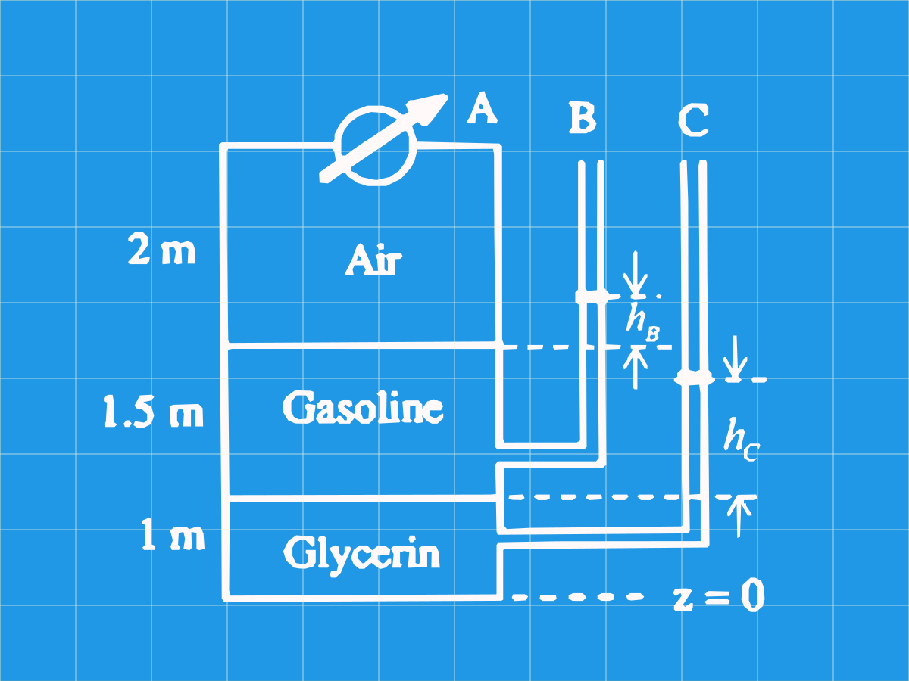

## Problema 1 Manometría (Frank White - Fuild Mechanics P.2.11)

### Enunciado

En la figura el manómetro A marca 1.5 kPa (manométrica). Los fluidos se encuentran a 20ºC Determine la elevación $z$ en metros del nivel al que se encuentran los líquidos en los tubos B y C. _Fuente: Fluid Mechanics - Frank White 8th Edition P 2.11_

De tablas $\gamma_{gasolina} = 6670 N/m^{3}$ y $\gamma_{glicerina}= 12360 N/m^{3}$

G-GTDD8G8W0R

4098152643

## Solución

Realizan un análisis de presiones manométricas:

$$
P_A - \gamma_{gasolina} h_B = P_B \\
1500\space Pa - 6670\space N/m^{3}\space h_B=0\\
h_B=22.5 \space cm
$$

Tomando z como referencia

$$
z_B = (1+1.5 +h_B) = 2.725 m
$$

$$
1500\space Pa+1.5 \cdot 6670N/m^3-h_C \cdot 12360\space N/m^3 = 0\\
h_C=193.1cm
$$

Entonces $z_C=1.931m$
