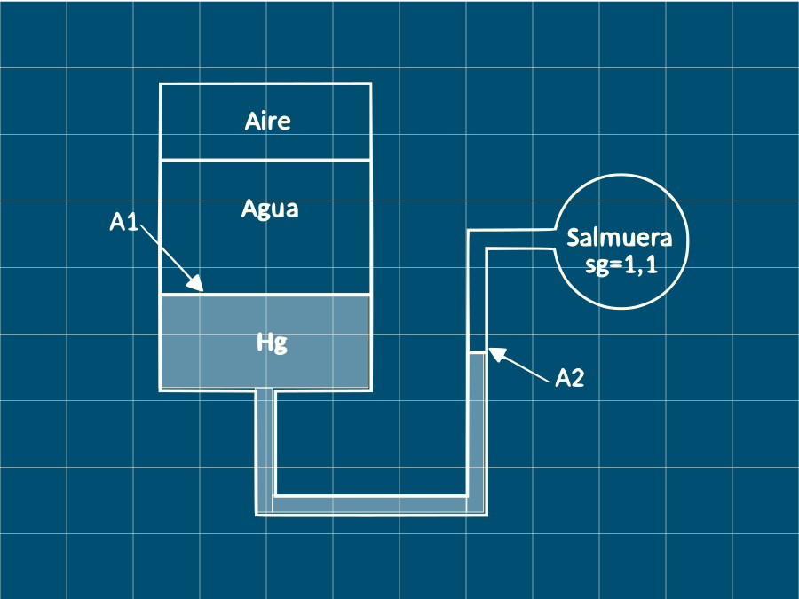

## Problema 39 Manometría

Considere el sistema que se muestra en la figura. Si ocurre un cambio de 700 kPa en la presión del aire de que causa que la interfaz salmuera -  mercurio de la columna descienda 0,005 m. La presión de la salmuera se mantiene constante. Determinar la relación de áreas A2/A1.

Se realiza un diagrama del sistema antes y después del cambio de presión

Aplicando la regla del manómetro antes del cambio de presión:

$$
P_{\text {aire }(1)}+h_{\text {agua }} \gamma_{\text {agua }}+h_{\mathrm{Hg}(1)} \gamma_{\mathrm{Hg}}-h_{\text {sal }(1)} \gamma_{\text {sal }}=P_{\text {sal }}\space\space\space\space(1)
$$

Aplicando la regla del manómetro después del cambio de presión:

$$
 P_{\text {aire }(2)}+h_{\text {agua }} Y_{\text {agua }}+h_{H g(2)} Y_{H g}-h_{\text {sal }(2)} Y_{\text {sal }}=P_{\text {sal }}\space\space\space\space(2) 
$$

Escribiendo la diferencia de alturas como: 

$$
\left(P_{\text {aire } 22}-P_{\text {aire } 11}\right)+\Delta h_{H g} Y_{H g}-\Delta h_{\text {sal }} Y_{\text {sal }}=0 \space\space\space\space(3)
$$

Donde: $\Delta h_{\text {sal}}=0,005m$

Por otro lado:$\Delta h_{H g}=\Delta h_{H g(\text { derecha) }}+\Delta h_{H g \text { (iquierda) }}\space\space\space\space(4)$

Donde:$\Delta h_{H q} (derecha)  =\Delta h_{\text {sal }}\space\space\space\space(5)$

Ahora, se debe notar que el volumen del mercurio permanece constante:
$$
\begin{array}{c}V_{H g(\text { derecha })}=V_{H g(\text { izquierda })} 
\\A_{1} \Delta h_{H g(\text { izquierda })}=A_{2} \Delta h_{H g(\text { derecha })}\end{array}
$$

Despejando:
$$
\Delta h_{\mathrm{Hg} \text { (izquierda) }}=\frac{A_{2}}{A_{1}} \Delta h_{\mathrm{Hg} \text { (derecha) }}(6)
$$

Reemplazando (6) y (5) en (4):

$$
\Delta h_{H g}=\Delta h_{s a l}+\Delta h_{s a l} \frac{A_{2}}{A_{1}}=\Delta h_{s a l}\left(1+\frac{A_{2}}{A_{1}}\right)(7)
$$

$$
\left(P_{\text {aire } 22}-P_{\text {aire } 11}\right)+\Delta h_{\text {sal }}\left(1+\frac{A_{2}}{A_{1}}\right) Y_{H g}-\Delta h_{\text {sal }} Y_{\text {sal }}=0(8)
$$

Por condición del problema se sabe que:
$$
P_{\text {aire (2) }}=P_{\text {aire(1) }}-700 \rightarrow P_{\text {aire } 21}-P_{\text {aire } 11}=-700(9)
$$

Despejando de la ecuación (8):

$$
\frac{A_{2}}{A_{1}}=\frac{\Delta h_{\text {sal }} \gamma_{\text {sal }}-\left(P_{\text {aire } 22}-P_{\text {aire } 11}\right)}{\Delta h_{\text {sal }} \gamma_{H g}}-1=\left(\frac{0,005 \cdot 1,1 \cdot 9810-(-700)}{0,005 \cdot 13,6 \cdot 9810}-1\right)
$$

$$\frac{A_{2}}{A_{1}}=0,130$$
