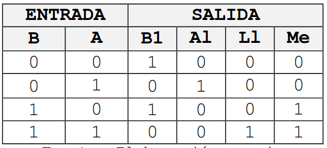
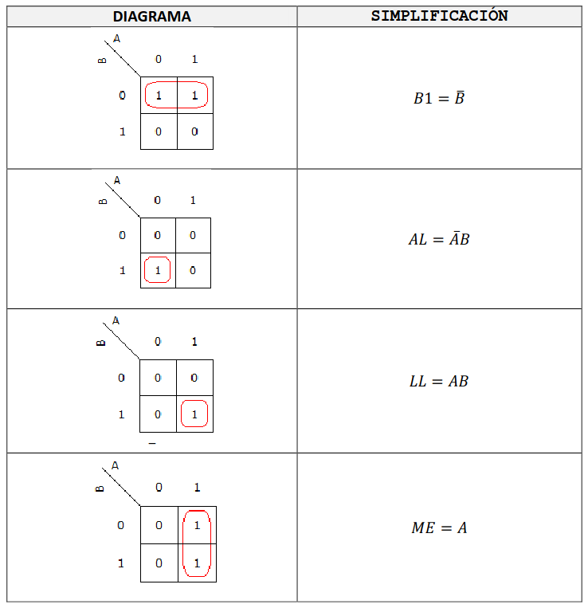
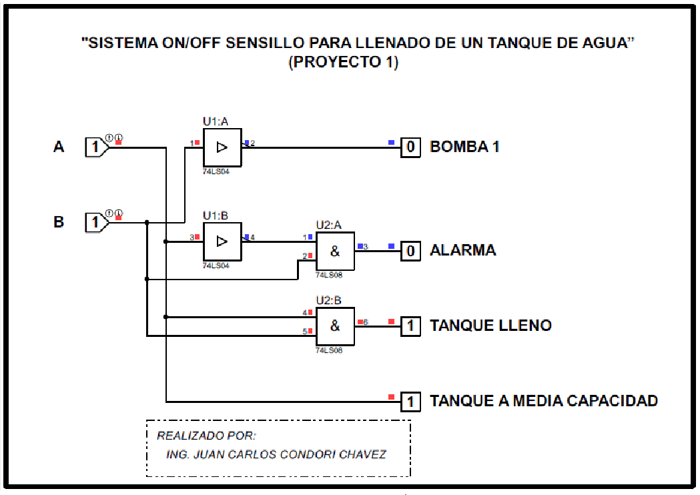
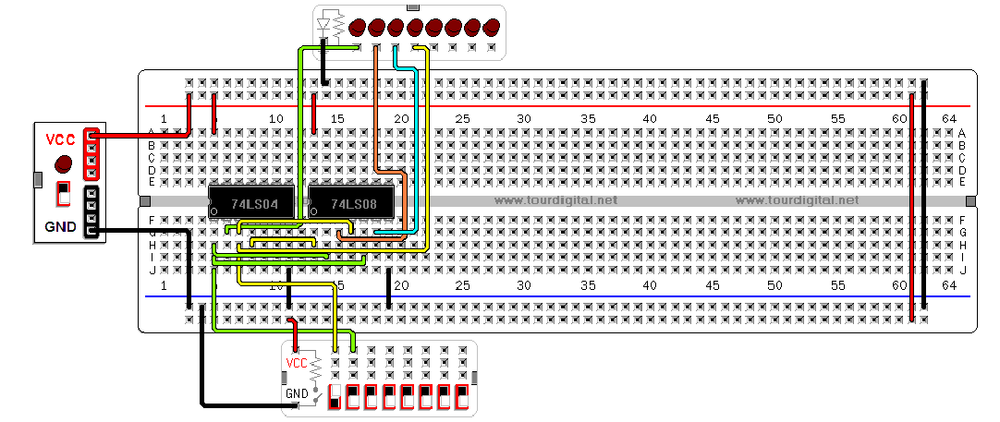

## Controlador de nivel de un tanque

Requerimos que nuestra bomba del diagrama mostrado siempre se encuentre siempre se encuentre cómo mínimo lleno a media capacidad. Para ello configuramos el encendido y apagado de una bomba controlada a través de dos sensores de nivel, el primero será el sensor alto que indicara tanque lleno y apagara la bomba, el segundo estaría instalado en la parte central del tanque para que cuando llegue hasta ese nivel la bomba nuevamente se encienda y llene el tanque.

## Construcción de la lógica 

Es necesario obtener una función lógica que permita controlar el llenado de un tanque como se muestra en la figura, para ello disponemos de una bomba (B1) y los sensores de nivel A y B. el funcionamiento del automatismo es el siguiente:

Cuando se llena el tanque la bomba B1 debe de funcionar hasta que cubra el sensor A y apagarse cuando cubra el sensor B.

Para ponerse en marcha nuevamente la bomba B1 debemos de proporcionar una señal de estado 1 y para parada el estado de la señal debe de ser 0. Los sensores A o B adquieren un estado 1 cuando el agua los cubre y 0 caso contrario.Los indicadores luminosos de media (Me) y lleno (LL) los utilizamos para señalar los distintos niveles de agua del tanque y alarma (AL) para indicar cualquier situación anómala.

### Con la simplificación por diagrama de Karnaugh

### Simulación en bloques lógicos es:

### Simulación en el programa de "Constructor virtual de circuitos"

### Implementación del circuito

**Del circuito representa lo siguiente:**

* Verde: Bomba
* Rojo: Falla
* Azul: Indica tanque lleno
* Naranja: Tanque a capacidad media

**El swich:**

* A: Sensor de capacidad media.
* B: Sensor de nivel alto.

**Cuando A = 0 y B = 0**: Se encenderá el led verde, indicando funcionamiento de la bomba.

**Cuando A = 1 y B = 0**: Señal de error se encendera el led rojo. Indicando que hay un error en los sensores.

**Cuando A = 0 y B = 1**: Se encenderá el led verde. Indicando de funcionamiento de la bomba.

**Cuando A = 1 y B = 1**: Se enciendo el led azul. Indicando que el tanque esta lleno.

## Referencias

* Guía de proyectos de control automático
